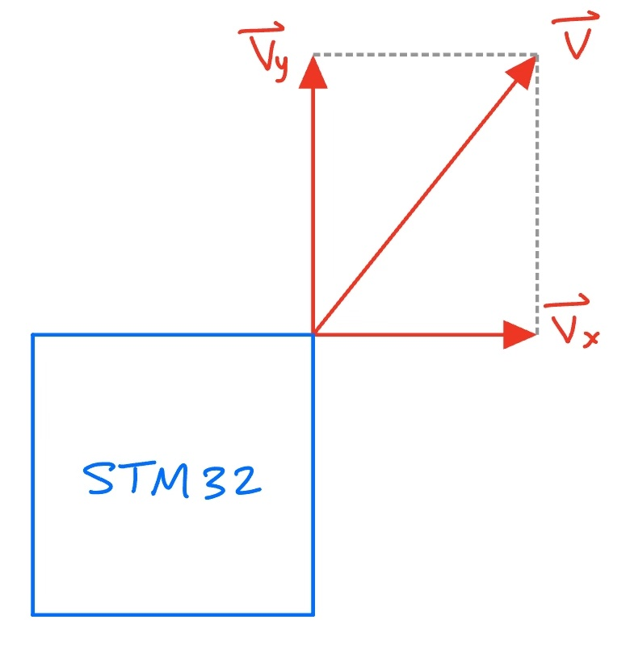
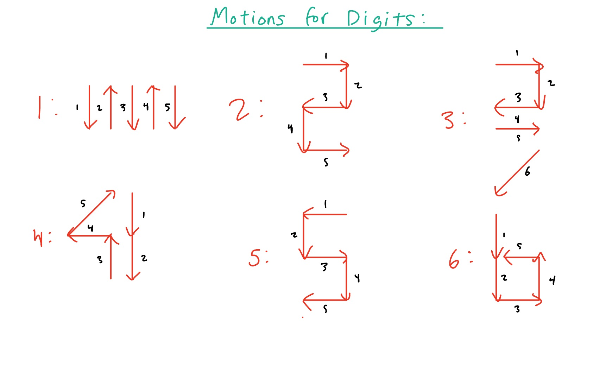
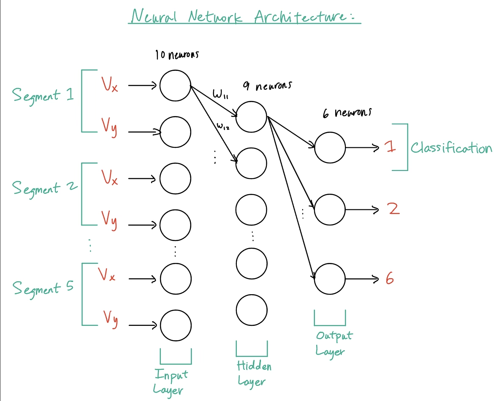
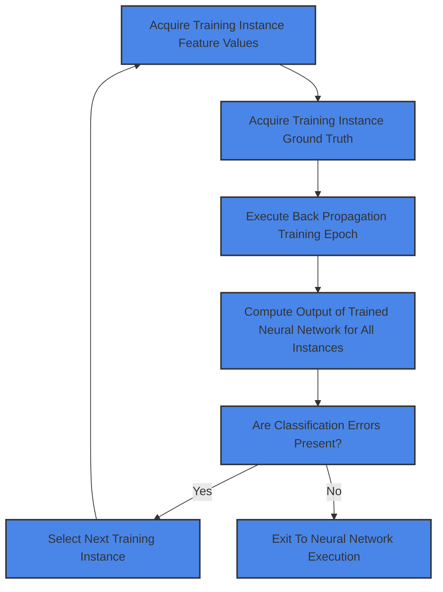
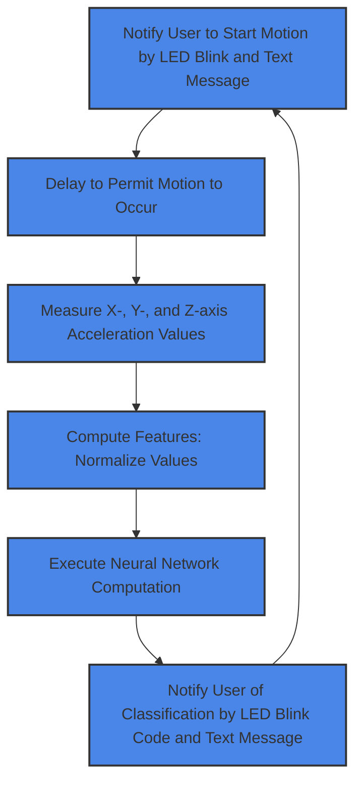

#### Motion Classification 
- This project utilizes Digital Signal Processing and Machine Learning techniques to classify motion patterns: in this specific use case: digits!
- It utilizes the ARM-Based STM32 Microcontroller and its on-board accelerometer
	- This board had 2 megabytes of Flash memory with 786 Kilobytes of SRAM
- This project is written in C and utilizes the STM Cube IDE 

#### System Design:

#### Feature Data Acquisition: Calculating Velocity
- To detect motions I had to extract the velocity from each movement
- To do this we can integrate our acceleration readings by sampling the accelerometer output and utilizing the trapezoidal approximation
**Calculating Velocity**:

$$
\displaystyle v_x(t) = v_x(t = 0) + \int_{\tau = 0}^{\tau = t} a_x(\tau) \, d\tau
$$

**Trapezoidal Approximation**: Allows for easier calculation of velocity

$$
\displaystyle
\int_{\tau = a}^{\tau = b} a_x(\tau) \, d\tau = (b - a) \left( \frac{a_x(b) + a_x(a)}{2} \right)
$$

**Utilizing Sampling and the Trapezoidal Approximation**:

$$
\displaystyle
v_X(n) = v_X(n = 0) + \sum_{i=1}^{i=n} \frac{(a_X(i - 1) + a_X(i))}{2} T_{sample}
$$

$$
\displaystyle
v_Y(n) = v_Y(n = 0) + \sum_{i=1}^{i=n} \frac{(a_Y(i - 1) + a_Y(i))}{2} T_{sample}
$$

$$
\displaystyle
v_Z(n) = v_Z(n = 0) + \sum_{i=1}^{i=n} \frac{(a_Z(i - 1) + a_Z(i))}{2} T_{sample}
$$

**Note**: In this project the z axis acceleration is subject to gravity thus making it harder to accurately utilize so we only use x and y axis velocities

#### Problem: Signal Noise
- **Problem**: The accelerometer values that are read are not zero but are an offset
- This can lead to large errors when integrating over it
- **Problem**: Tilt Errors occurred when the Z axis acceleration due to gravity is projected onto the Z and Y axis accelerometers 
	- We can use digital filtering to filter out static and slowly changing signals from offset and tilt errors
- The acceleration signal also contains noise because of the high frequency vibrations present nearby 

#### Digital Signal Processing: Bigger Picture

### Filter Design
- In analog processing we can use the Laplace transform to convert time domain functions to the frequency domain
- **High Pass**: signal frequencies below $\large\frac{f_c}{10}$ the signal is attenuated to near zero
- **Low Pass**: signal frequencies above $\large10f_c$ the signal is attenuated to near zero

#### Low Pass Filter
- Allows frequencies below the cutoff frequency: $f_c$ to pass through the filter while attenuating signals above the cutoff frequency
- We use this to remove high frequency noise not related to motion

#### High Pass Filter
- Allows frequencies above the cutoff frequency: $f_c$ to pass through the filter while attenuating signals below the cutoff frequency
- Applied to accelerometer output signals to remove low frequency noise not related to motion

#### Infinite Impulse Response (IIR) Filters
- Filters can be applied to digital signals using the Z-transform (the digital counterpart to the Laplace transform)
- Doing so allows you to take approximations and simplify the differential equation into an algebraic term with constants 
- This is much easier to implement in code especially in C
**Low Pass IIR Filter**: 

$$
\displaystyle
y(n) = \gamma_1 x(n) + \gamma_1 x(n - 1) - \gamma_2 y(n - 1)
$$

**High Pass IIR Filter**:

$$
\displaystyle
y(n) = (1 - \gamma_1)x(n) + (1 - \gamma_1) x(n - 1) - \gamma_2 y(n - 1)
$$

Where:

$$
\displaystyle
\gamma_1 = \frac{1}{1+\frac{2}{Tw_o}}
$$

and

$$
\displaystyle
\gamma_2 = \left(1 - \frac{2}{Tw_o}\right)\gamma_1
$$

**Idea**: Using both of these we can attenuate both unwanted high frequency and low frequency noise to properly detect velocity effectively creating a bandpass filter
#### Feature Acquisition 
- Feature 1 is set to the X axis velocity
- Feature 2 is set to the Y axis velocity
- They are set to these velocities if and only if their magnitude: $\sqrt{v_{x}^2+v_{y}^2} > v_{threshold}$

#### How Feature Data is Acquired
- Feature data is acquired by collecting data from five different segments:

#### Feature Collection utilizing a Finite State Machine (FSM)
- `motion_state = 0`
	- a. IoT Platform motion velocity is less than a threshold value, velocity_mag_threshold. 
- `motion_state = 1`
	- a. IoT Platform motion velocity has exceeded the threshold value, velocity_mag_threshold. 
	- b. At the time when this velocity above threshold is detected, two feature values are set: 
		- i. Feature 1 is set equal to X-axis velocity 
		- ii. Feature 2 is set equal to Y-axis velocity 
- If `motion_state = 1` and the change in velocity is less than a threshold, velocity_diff_threshold for both X and Y velocity, then the IoT Platform motion is recognized to have terminated
- Repeating this process five times we can collect each of the motion segments

#### Feature Normalization prior to the Neural Network
- Before we input a feature to the neural network we have to normalize it with the softmax algorithm  
$\large v_{norm} = \sum{(V_{nx}^2+V_{xy}^2)}$
- We sum up all of the two velocities for each the five motion segments
**For each M input features** (10):
$\large F_m = \frac{V_{mx}}{V_{norm}}$ and $\large F_m = \frac{V_{my}}{V_{norm}}$

#### Neural Network Architecture
- We have ten inputs because there are two X and Y velocities for five different motion segments thus 10 input neurons
- Our hidden layer has 9 neurons because that is what produced the best results after training
- There are six output neurons for six different digits it can classify 

#### Neural Network Training Process

#### Neural Network Execution

#### Project Results and Evaluation
- Sampling results across fifty different classifications this system predicted 47 of them to be the correct digit: 94% Accuracy!
	- The wrong predictions were likely to have been introduced by human error in data collection
- This project is a dynamic system that can train on changing data depending on what we want to classify in the field and Embedded ML is very flexible and dynamic 
	- In this case we are simply detecting digits and can recognize different letters and digits 
- I enjoyed this project because Internet of Things (IoT) requires many disciplines of engineering including: Transducers and Sensors, Digital Signal Processing, Embedded Systems, and Machine Learning!
**Product use and Application**: Education and Accessibility
- This product can be used to teach young children how to correctly draw numbers and provide feedback
- This product can also be used to aid those who do not have the dexterity to draw numbers but can move a box to

#### Thank you
- This appendix contained a lot of the nitty gritty details I had to learn to create this project
- It also took a long time to make and I appreciate you for taking the time to get down here! 
